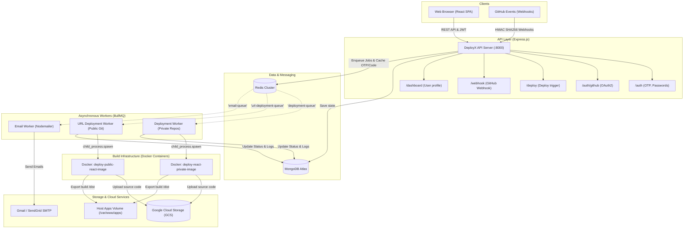
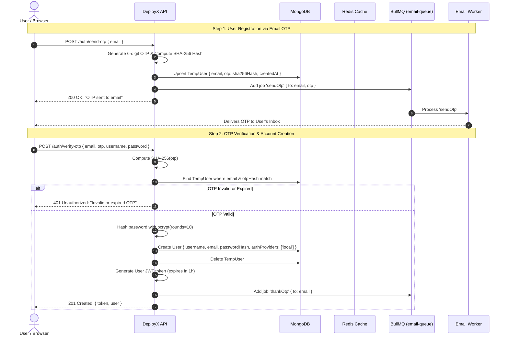
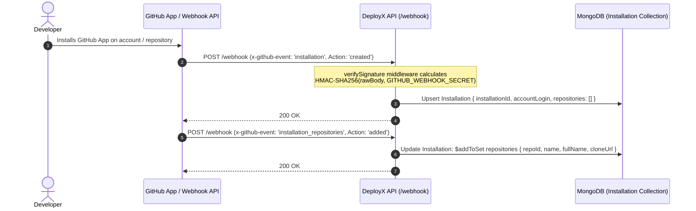
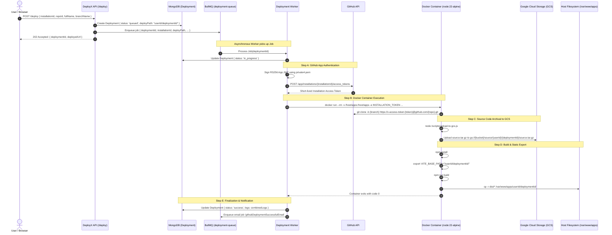

# DeployX Backend Architecture & System Design

This document provides a comprehensive technical overview of the **DeployX Backend Architecture**. It is designed for software engineering students, architects, and developers who want to understand the design patterns, data flows, and infrastructure underlying a modern cloud deployment platform.

---

## 1. High-Level System Topology

DeployX operates as an **asynchronous, event-driven platform**. Long-running operations such as cloning code, running `npm install`, executing Vite builds, and uploading source code to Google Cloud Storage (GCS) are decoupled from the main HTTP API server using **BullMQ** and **Redis**.

---

## 2. Authentication & OTP Security Lifecycle

DeployX supports two login methods:
1. **Local Authentication**: Uses Email + 6-digit OTP verification + bcrypt password hashing.
2. **GitHub OAuth 2.0**: Uses passport-github2 with short-lived Redis authorization codes to exchange for JWTs.

---

## 3. GitHub App & Webhook Synchronization Flow

When a user links their GitHub account and installs the DeployX GitHub App, GitHub notifies the backend via Webhooks signed with HMAC SHA-256.

---

## 4. End-to-End Deployment Execution Engine

This diagram illustrates how a deployment is requested, queued, and executed in an isolated Docker container, streaming build logs and uploading source code to Google Cloud Storage.

---

## 5. Architectural Principles

### 1. Decoupling & Non-Blocking I/O
- Node.js runs on a single-threaded event loop. If git clone, `npm install`, or Vite build were run inside the HTTP route handlers, the server would freeze and fail to serve other incoming requests.
- **Solution:** By offloading builds to BullMQ workers, the API responds in under 50 milliseconds with HTTP `202 Accepted`.

### 2. Sandbox Container Isolation
- Building arbitrary user code directly on the host machine is dangerous: malicious `postinstall` npm scripts could read system files, delete directories, or compromise secrets.
- **Solution:** Every build runs inside a transient Docker container (`--rm`), restricting file system writes strictly to the mounted application target directory.

### 3. Dual Storage Strategy
- **Static Frontend Assets:** Stored locally on the host at `/var/www/apps/<userId>/<deploymentId>/` for immediate, low-latency static file serving via Nginx or Express static middleware.
- **Source Code Snapshot:** Uploaded to **Google Cloud Storage (GCS)** (`source/<userId>/<deploymentId>/source.tar.gz`), ensuring that historical source code snapshots are permanently backed up and recoverable.
