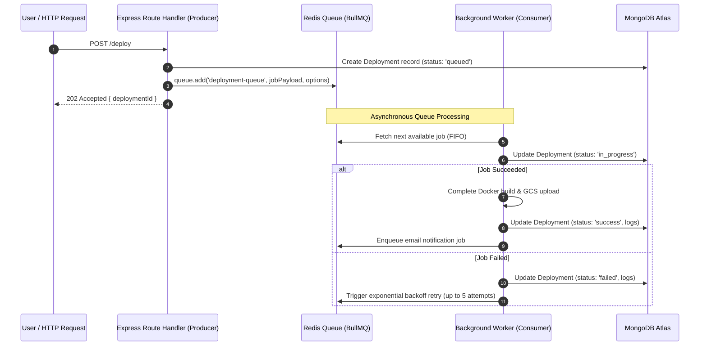

# BullMQ & Redis Worker Architecture

This guide explains how **BullMQ** and **Redis** power the asynchronous background processing in DeployX.

---

## 1. Why Use Background Queues in Production?

In web applications, some operations take milliseconds (e.g. database lookups, generating a token), while others take seconds or minutes (e.g., cloning a git repository, running `npm install`, compiling frontend assets, sending emails through an SMTP relay).

If long-running tasks are handled synchronously inside an HTTP request:
1. **Request Timeouts:** Browsers and reverse proxies (like Cloudflare, Nginx, or AWS ALB) terminate HTTP connections after 30–60 seconds, resulting in HTTP `504 Gateway Timeout`.
2. **Server Starvation:** The Node.js event loop or worker threads become blocked or overloaded, degrading responsiveness for other users.
3. **Lost Jobs on Crash:** If a server restarts while executing a build, in-memory jobs are lost forever.

### The Queue Solution
By placing long-running tasks into a persistent **Redis queue**:
- The API server accepts the request, persists a record in MongoDB, pushes a lightweight job to Redis, and immediately returns HTTP `202 Accepted`.
- Background workers pick up jobs at their own pace, with automatic retry mechanisms and concurrency controls.

---

## 2. Queue Inventory in DeployX

| Queue Name | File Location | Handled By | Typical Execution Time |
| :--- | :--- | :--- | :--- |
| `deployment-queue` | `queue/deploymentQueue.js` | `workers/deploymentWorker.js` | 30s – 3 mins |
| `url-deployment-queue` | `queue/urlDeploymentQueue.js` | `workers/urlDeploymentWorker.js` | 30s – 3 mins |
| `email-queue` | `queue/emailQueue.js` | `workers/emailWorker.js` | 500ms – 2s |

---

## 3. Producer-Consumer Lifecycle



---

## 4. Exponential Backoff & Retry Strategies

Transient network glitches or temporary GitHub API rate limits should not cause permanent deployment failures. DeployX configures exponential backoff retries:

```javascript
await deploymentQueue.add('deployment-queue', jobPayload, {
  attempts: 5,
  backoff: {
    type: 'exponential',
    delay: 1000 // Initial retry delay = 1 second
  }
});
```

### Backoff Progression:
- **Attempt 1:** Immediate execution.
- **Attempt 2 (Retry 1):** 1 second delay (`1000ms * 2^0`).
- **Attempt 3 (Retry 2):** 2 seconds delay (`1000ms * 2^1`).
- **Attempt 4 (Retry 3):** 4 seconds delay (`1000ms * 2^2`).
- **Attempt 5 (Retry 4):** 8 seconds delay (`1000ms * 2^3`).

If all 5 attempts fail, the job is marked as `failed` in BullMQ and stored for administrator inspection (`removeOnFail: false`).

---

## 5. Concurrency Tuning

Workers are configured with concurrency limits to protect host system resources:

```javascript
const worker = new Worker('deployment-queue', processJob, {
  connection,
  concurrency: 5 // Maximum 5 Docker containers executing concurrently
});
```

### Why Concurrency Limits Matter
- Running `npm install` and Vite builds consumes substantial CPU and RAM (e.g. 500MB – 1.5GB per build).
- If 50 users trigger builds simultaneously, running 50 Docker containers concurrently would crash the host server (Out of Memory error).
- With `concurrency: 5`, only 5 builds run simultaneously. The remaining 45 jobs remain safely buffered in Redis until capacity frees up.

---

## 6. Worker Event Listeners

BullMQ provides comprehensive event hooks for observability:

```javascript
worker.on('ready', () => {
  console.log('[Worker] Connected to Redis and ready for jobs.');
});

worker.on('completed', (job) => {
  console.log(`[Worker] Job ${job.id} completed successfully.`);
});

worker.on('failed', (job, err) => {
  console.error(`[Worker] Job ${job?.id} failed with error:`, err.message);
});
```
